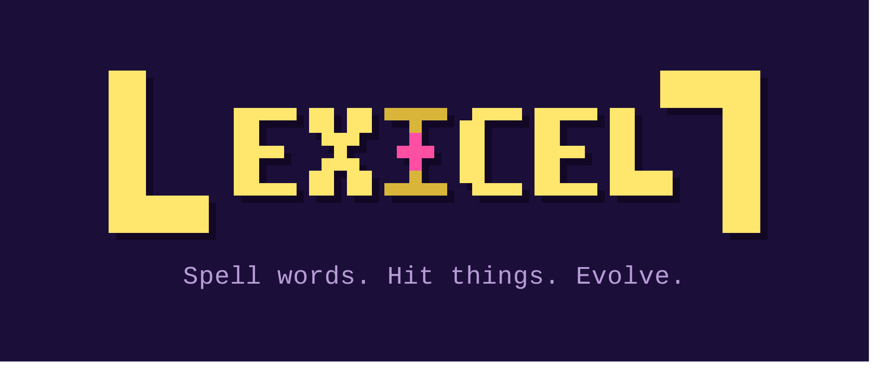
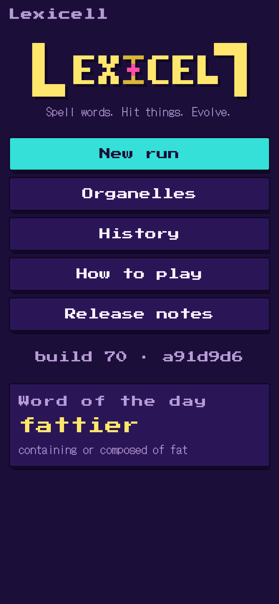
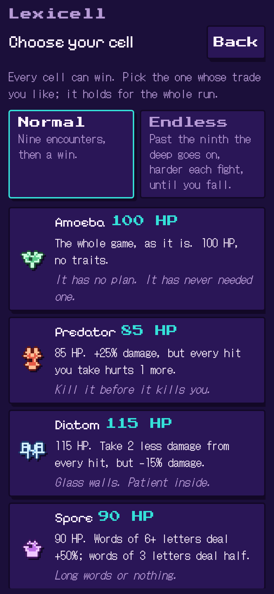
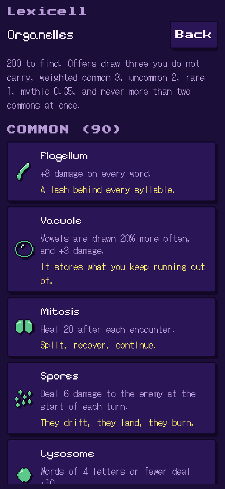
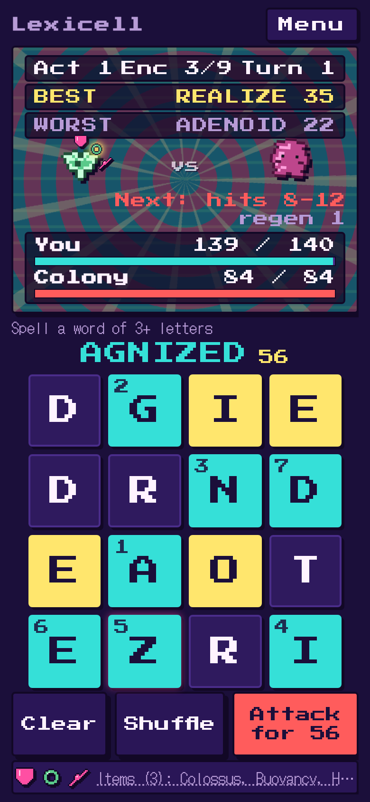
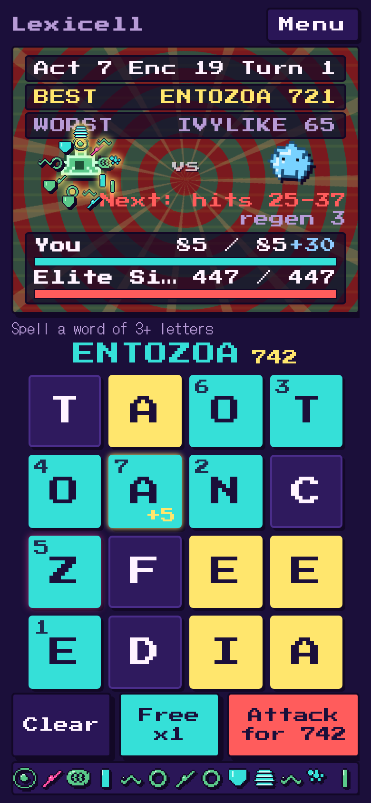

<div align="center">



**Spell words. Hit things. Evolve.**

A mobile-first word-battle roguelike. You are a single cell: spell words from a
letter grid to attack, pick mutations and traits between fights, and descend
until the deep takes you. Single player, no accounts, no backend, no unlocks.

[](https://github.com/dtammam/lexicell/actions/workflows/ci.yml)
[](https://github.com/dtammam/lexicell/actions/workflows/docker-publish.yml)
[](https://hub.docker.com/r/deantammam/lexicell)
[](https://hub.docker.com/r/deantammam/lexicell)
[](LICENSE)

### [Play it now -> dtammam.github.io/lexicell](https://dtammam.github.io/lexicell/)

No install, no sign-up. It runs in the browser, saves your run on your device,
and adds to your phone's home screen as an app.

[Play](https://dtammam.github.io/lexicell/) · [Screenshots](#screenshots) · [Features](#features) · [Self-host with Docker](#self-host-with-docker) · [Roadmap](ROADMAP.md)

</div>

---

**What it is.** Lexicell is a cross-platform word puzzle game with roguelike
elements. You spell words from a four-by-four letter grid to attack, pick mutations
and traits between fights, and descend as far as your one health bar will carry you.
A normal run is fifteen to twenty minutes; Endless mode goes until the deep takes
you. It runs in any browser, on desktop or phone.

**What inspired it.** The core loop comes from word games I found very fun: Bookworm
Adventures, Wordle, and Words With Friends. The roguelike shape around it, an item
pool, probabilities, and enemies that each play differently, is in the spirit of
Binding of Isaac, Balatro, and Slay the Spire. The theme is evolution, drawn from
Plague Inc. The look is a homemade retro pixel style called Plasma, built around
evolution and instability, with a debt to Earthbound's quirky visuals. It is a lot
of things I have loved in games over a long time, gathered in one place.

**How it was made.** I built Lexicell with an agentic development process I have used
on other projects, [Arcade Station](https://github.com/dtammam/arcade_station),
[tasksync](https://github.com/dtammam/tasksync), and
[FileTube](https://github.com/dtammam/filetube), now pointed at a domain that was new
to me: game development. New builds ship continuously, as ideas come up.

Every merge to main is a public release, automatically, to both the link above
and Docker Hub. The title screen shows the build number, and there is a Release
notes page in the game listing every build since the first commit.

## Screenshots

<p align="center">
  
  &nbsp;
  
  &nbsp;
  
</p>

<p align="center">
  
  &nbsp;
  
</p>

## Features

- **Spell to fight.** A four-by-four letter grid, no timer, no hand limit. Longer
  and rarer words hit harder; used tiles refill. The grid is never a dead end, so
  a run never soft-locks.
- **A single cell, five ways to start.** Amoeba, Predator, Diatom, Spore or
  Mycelium, each with its own HP and a built-in quirk, all tuned to win within ten
  points of each other. Pick who you are before the first fight.
- **200 mutations to draw.** After each won fight you are offered three, keep one.
  They change how words score, how tiles are drawn, and how damage flows, from
  common lashes to glowing mythics.
- **Evolve after a boss.** Beat a boss and your body changes: a thicker membrane,
  venom glands, a taste for rare letters. A trait is always on and applies before
  your mutations.
- **Enemies that fight back.** Twelve creatures and three bosses across three acts,
  with armour, regen, hunger and venom, each telling you its next move. Every run
  also hides an elite, a rest and a small trade among the fights.
- **Normal or Endless.** Normal is nine encounters and a win. Endless goes on past
  the ninth, harder every fight, a boss every third, until the deep takes you.
- **Attrition is the tension.** One health bar for the whole run. No healing
  between fights unless a mutation or a rest stop gives it.
- **Yours, offline, on your phone.** Installable PWA, plays with airplane mode on,
  one saved run in your browser. No accounts, no server, no meta-progression:
  every run starts from zero.

## Self-host with Docker

The link at the top is the front door and needs nothing from you. This section is
for tinkerers who would rather run their own copy. It is a single static nginx
container, no backend and nothing to configure.

You will need **Docker** with **Docker Compose**.

```bash
git clone https://github.com/dtammam/lexicell.git
cd lexicell
docker compose up -d
```

Then open [http://localhost:8090](http://localhost:8090). To update to the newest
build later:

```bash
docker compose pull && docker compose up -d
```

The image is [`deantammam/lexicell`](https://hub.docker.com/r/deantammam/lexicell)
on Docker Hub. Every merge to main publishes the `edge` tag (and a `sha-<short>`),
so `edge` is always the latest build; the compose file follows it. Operator notes,
including putting it behind a reverse proxy with HTTPS for the home-screen install,
are in [docs/deploy.md](docs/deploy.md).

## Local development

Node **24+**. No Docker needed.

```bash
npm install
npm run dev      # http://localhost:5173, hot reload
npm test         # the full suite
npm run lint     # eslint, tsc, svelte-check
npm run sim      # headless balance simulation
```

Architecture, decisions and scope are in
[docs/lexicell-architecture-pack.md](docs/lexicell-architecture-pack.md); coding
standards and commands in [docs/CONTRIBUTING.md](docs/CONTRIBUTING.md). The engine
under `src/engine/` is pure, seeded and framework-free, with tests beside every
module; the UI is Svelte and the only third-party code that ships to the device.

## Roadmap

What has shipped, what the review gate caught, and what is still open live in
[ROADMAP.md](ROADMAP.md). The in-game Release notes page carries a player-facing
entry for every build.

## License

[MIT](LICENSE) (c) 2026 Dean Tammam
