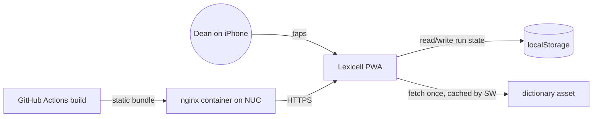
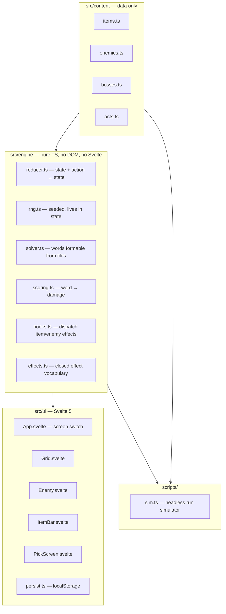

# Lexicell — Architecture Pack

*Opening brief for the coding agent. Read in order. Generated 2026-09-06.*

---

# Lexicell — Problem Statement


---

## 1. What problem does this solve?

Dean wants a Bookworm Adventures–style word-battle game with roguelike run variety that he can play on his phone in a single sitting, and that he owns and hosts.

---

## 2. Who is the user?

Dean. Solo player. iPhone, Safari, installed as a PWA to the home screen. Short sessions: couch, bed, waiting somewhere. One-handed portrait use. Possibly offline. No other users in v1.

---

## 3. What does the user do with it?

**Flow A — Start a run**
Open app → tap "New run" → first encounter begins immediately. No menus, no character select, no narrative screen.

**Flow B — Fight one turn** *(assumed Bookworm-faithful — confirm)*
See 16 letter tiles in a 4×4 grid and an enemy with an HP bar → tap tiles to spell a word → tap "Attack" → damage is computed from the word and applied → used tiles are replaced → enemy attacks back (damage and/or a status effect on the player or on tiles) → repeat until one side is at 0 HP.

**Flow C — Pick an item**
After a won fight → shown 3 items → tap one → it's added to the run's active item set → next encounter. Items modify how words score, how tiles are drawn, or how damage flows.

**Flow D — Boss, win, lose**
Every third encounter is a boss with a distinct mechanic. Lose at any point → run over, summary screen, "New run". Beat the third boss → win, summary screen, "New run".

**Flow E — Resume**
Close the app mid-run → reopen → back to the same encounter and turn.

---

## 4. What exists today?

- **Bookworm Adventures** (PopCap, 2006/2009): Windows only, linear campaign, not on mobile, not a roguelike, not owned by Dean.
- **Balatro**: the reference for a roguelike built on one skill input plus a large modifier library — but poker, not words.
- **Word-Balatros**: some indie titles likely exist (2024–26). Unverified. **Action item: 10-minute Steam / App Store search before the spike.** If one nails this, the reason to build shifts from "it doesn't exist" to "I want to own and hack on it" — still valid, but say so.

---

## 5. What does success look like?

v1 is done when all of the following are true:

1. Dean completes a full run on his iPhone, start to win screen, without leaving the browser.
2. The run takes 15–20 minutes.
3. He wants to start another run immediately.
4. Two consecutive runs feel different because of the items drawn, not because of the words available.
5. No run ever soft-locks on a grid with no valid words.
6. The app loads and plays with airplane mode on.

---

## Assumptions made on Dean's behalf (correct these)

- Turn structure is Bookworm-faithful: 16 tiles, no timer, no hand limit, used tiles refill.
- No meta-progression: nothing carries between runs except optionally a run history.
- Theme (single cell → complex organism) is cosmetic: it drives stage names, enemy art, and palette. It does not change rules.

---

# Lexicell — Scope

---

## Everything mentioned or implied

Captured without filtering, from the first conversation:

16-tile word grid · word validation · damage scales with word complexity · enemy HP and retaliation · enemy status effects · gem tiles from long words · potions · scramble · large collectible item library · modifiers picked on level-up · roguelike run loop · endless mode · ~10 levels · evolution theme (single cell → complex creature) · time/era jumps (e.g. medieval Italy) · era-specific vocabulary · era-based boosts · cartoon flat 2D art · PWA · mobile-first · self-hostable · publishable online · save/resume · no meta-progression · 15–20 minute runs

---

## MoSCoW

| Priority | Feature | Notes |
|---|---|---|
| **Must** | 4×4 tile grid, tap-to-spell, validate against a dictionary | Core input. ENABLE wordlist client-side. |
| **Must** | Scoring formula: word → damage | Base score × multiplier structure. Every item hooks into this. Load-bearing decision. |
| **Must** | Enemy with HP, an attack, and at least one status effect | Otherwise it's a solitaire word game. |
| **Must** | Run structure: 3 acts × (2 fights + 1 boss) = 9 encounters | Fits the 15–20 min target. |
| **Must** | Item pick (3 offered, choose 1) after each won fight | The roguelike part. |
| **Must** | 20–30 tuned items on a data-driven hook system | Items are JSON against fixed hooks: `onWordScored`, `onTileDraw`, `onTurnStart`, `onDamageTaken`, tile modifiers. |
| **Must** | 3 bosses, each with one distinct mechanic | Act capstones. |
| **Must** | Dead-grid handling | Solver detects no-valid-word grids; auto-scramble or guaranteed-solvable generation. |
| **Must** | Seeded RNG, deterministic run from a seed | Needed for testing, balancing by simulation, and bug reproduction. Cheap now, painful later. |
| **Must** | Resume interrupted run | Single saved run state in IndexedDB/localStorage. |
| **Must** | Installable PWA, offline-capable | Service worker, manifest, dictionary cached. |
| **Must** | Portrait mobile layout, one-handed | Desktop is "it doesn't break." |
| **Should** | Gem tiles minted by long words with tile-level effects | Bookworm's best mechanic. Second pass once scoring is stable. |
| **Should** | Enemy effects that target tiles (locked, poisoned, rotting) | Creates decisions beyond "longest word." |
| **Should** | 3 visual "eras" — one per act — palette, enemy set, stage name | The theme, done cheaply. |
| **Should** | Sound and basic hit/score animation | Game feel. CSS/Svelte transitions suffice. |
| **Could** | Consumable potions / scramble charges | Only if fights feel too deterministic. |
| **Could** | Run history and stats screen | Trivial once run state exists. |
| **Could** | Daily seed | Free once RNG is seeded. |
| **Could** | Endless mode after act 3 | Requires a scaling curve that doesn't exist yet. v2. |
| **Won't** | Era-specific dictionaries or vocabulary | N curated wordlists. Content project, not a feature. |
| **Won't** | Era-specific rules or mechanics | Theme is cosmetic in v1. |
| **Won't** | Meta-progression, unlocks, persistent upgrades | Dean's decision. Every run from zero. |
| **Won't** | Accounts, cloud save, leaderboards, sharing | No backend in v1. |
| **Won't** | Narrative, dialogue, story screens | Stage name and enemy name are the story. |
| **Won't** | Native app / App Store | PWA only. |
| **Won't** | Timer or real-time pressure | Assumed. Bookworm has none. |
| **Won't** | Desktop-first layout | Works, not optimized. |

---

## What This Is Not

- **This is NOT a content platform.** One dictionary, English, ENABLE. No era vocab, no themed wordlists, no custom dictionaries.
- **This is NOT a progression game.** Nothing carries between runs. If run 50 feels like run 1 with different items, that is the design working.
- **This is NOT a story.** Evolution and eras are art direction and naming, nothing more. If a mechanic "needs" an era to justify it, the mechanic is wrong.
- **This is NOT a multiplayer or social product.** No accounts, no server, no leaderboard, no sharing. "Publish online" means "put the static bundle on a domain," nothing else.
- **This DOES have a large item library in v1** (scope change, Dean, 2026-09-08: "v1 changes to 200 item pool"). The original line said twenty to thirty, each tuned, with the library growing later. The library grows now: a 200-item pool built on a widened effect vocabulary (`docs/exec-plans/active/effects-wave.md`), in batches of forty, each batch measured against the sim exit criteria before merge. "Each tuned" still holds: the per-item win-rate table is the tuning instrument, and an item that does not move a bot's win rate is a reskin and gets cut.
- **This is NOT endless in v1.** Nine encounters, then a win screen.
- **This is NOT a game-engine project.** No Phaser, no Godot, no canvas rendering. DOM and CSS.

---

## Riskiest assumption

**That word-spelling stays engaging when difficulty scales through item multipliers rather than through demanding harder words.**

Dean's vocabulary is fixed. Bookworm handles this with a slow, hand-tuned linear campaign. A roguelike with random item draws has to produce a satisfying power curve across 9 encounters, from any combination of 20–30 items, without ever requiring a 9-letter word to survive. If the scoring formula and item hooks can't produce that curve, there is no game — only a word-finder with a health bar.

**Validation plan (Phase 0 spike):** dictionary + grid solver + scoring formula + 10 placeholder items, as a CLI with no UI. Simulate a few hundred seeded runs with a "greedy best-word" bot and a "mediocre 5-letter" bot. If the mediocre bot can't reasonably win with good item draws, or the greedy bot can't lose, the formula is wrong — fix it before a single pixel is drawn.

---

## Open questions for Dean

1. Confirm Bookworm-faithful turn structure, or state changes.
2. Confirm theme is cosmetic in v1.
3. Does the player have HP that persists across encounters within a run (Slay the Spire) or reset each fight (Bookworm)? This shapes item design heavily. Recommendation: persists, with healing as an item/boss reward — it's where run tension comes from.

---

# Lexicell — Architecture Decision Records

Decisions 001–006. The scoring formula is deliberately absent: it is decided by the Phase 0 spike, not by argument.

---

# ADR-001: Platform Target

## Status
Accepted

## Context
Must play on Dean's iPhone, one-handed, offline-capable, self-hostable, and later publishable. Dean has shipped a PWA with push notifications before. No app store distribution wanted.

## Options Considered

### Option A: Native iOS (Swift/SwiftUI)
- Best game feel: haptics, audio, 120Hz animation, no browser quirks.
- Cons: new language and toolchain, Mac + Xcode required, no self-hosting story, App Store or sideloading for install.
- Risk: weeks lost to tooling before any gameplay.
- Effort: High

### Option B: Cross-platform wrapper (Capacitor / React Native)
- Web code, native shell, access to haptics.
- Cons: still needs Xcode and signing to get it on the phone; adds a build layer with no payoff until the web version is already good.
- Risk: solves a problem that doesn't exist yet.
- Effort: Medium, plus ongoing

### Option C: PWA
- Web stack Dean already uses. Install from Safari. Static files — trivially self-hosted and published.
- Cons: iOS Safari limitations — no `navigator.vibrate`, audio needs a user gesture to unlock, storage can be evicted if the app is not used for extended periods (installed PWAs are more protected than tabs — **verify current Safari behavior**), no 120Hz guarantee.
- Risk: low. Every limitation is cosmetic for a turn-based game.
- Effort: Low

## Decision
**Option C.** Native wrapping is a later decision that the web version doesn't preclude.

## Consequences
- Game feel comes from CSS animation and sound, not haptics.
- Audio must be unlocked on first tap.
- Save state should be small and resilient to eviction (a lost run is annoying, not catastrophic — that is the only state there is).

---

# ADR-002: Frontend Framework

## Status
Accepted

## Context
One screen, a few panels (grid, enemy, items, pick screen). No routing, no SSR, no data loading. Dean knows Svelte and TypeScript.

## Options Considered

### Option A: SvelteKit with `adapter-static`
- Familiar tooling. Vite under the hood.
- Cons: routing, `load`, SSR, and endpoints all exist and all get disabled. Every "how do I do X in Kit" answer includes concepts this project doesn't use.
- Effort: Low

### Option B: Vite + Svelte 5 (no Kit)
- Same compiler, same dev server, no framework surface beyond components and runes. Manifest is a static file; the service worker is generated at build time by a script in the repo (no PWA plugin, Dean's dependency ruling of 2026-09-08).
- Cons: if the project ever needs routes (settings page, run history), they get hand-rolled or Kit is added later — a small migration.
- Effort: Low

### Option C: React / Vue / vanilla
- No advantage over Svelte for Dean. Vanilla means hand-writing reactivity for a state-heavy UI.
- Effort: Low to Medium

## Decision
**Option B.** Kit was acceptable; Dean did not object to the recommendation. The cost of being wrong is a day.

## Consequences
- One `App.svelte` with a state-driven screen switch (`title | fight | pick | summary`).
- All game logic lives outside Svelte (see ADR-004). Components render state and dispatch actions.

---

# ADR-003: Rendering Approach

## Status
Accepted

## Context
Flat 2D cartoon look. Sixteen tiles, one enemy, a handful of HUD elements. Animations: tile select, tile refill drop-in, hit flash, number pop. Turn-based; nothing moves without a tap.

## Options Considered

### Option A: DOM + CSS
- Tiles are buttons. Layout via flex/grid. Animations via CSS transitions and Svelte transitions. Accessibility and touch handling for free. Text rendering is native.
- Cons: complex particle effects or hundreds of simultaneous animated elements get janky. Not a concern at this scale.
- Effort: Low

### Option B: Canvas via PixiJS
- Rich effects, sprite batching, shaders.
- Cons: hand-rolled hit testing, text, layout, and touch. Doubles UI effort for effects the design doesn't call for.
- Effort: Medium to High

### Option C: Game engine (Phaser, Godot web export)
- Scenes, tweens, asset pipeline, physics.
- Cons: new mental model; PWA/mobile export is an afterthought in both; Godot web builds are large and iOS Safari support has had rough patches. Résumé-driven for this project.
- Effort: High

## Decision
**Option A.** Revisit only if a specific effect is designed that CSS cannot do.

## Consequences
- Art is SVG or PNG placed in DOM. Enemy art can start as an emoji or a colored blob.
- "Juice" budget: tile spring on select, drop-in on refill, screen shake on big hits, floating damage numbers. All CSS.

---

# ADR-004: Game Core Architecture

## Status
Accepted

## Context
The riskiest assumption (scope doc) is validated by simulation, which requires the game to run headless. Save/resume requires serializable state. Items must be data. Runs must be reproducible from a seed.

## Options Considered

### Option A: Logic inside Svelte components and stores
- Fast to start.
- Cons: not testable without a DOM, not simulatable, state scattered, items become `if` branches in components.
- Effort: Low now, high later

### Option B: Pure TypeScript engine, reducer-style, framework-free
- `state = reduce(state, action, rng)`. State is a plain serializable object. RNG is seeded (e.g. mulberry32 or xoshiro) and lives in state as a seed + counter. Items are JSON definitions; the engine dispatches hooks (`onWordScored`, `onTileDraw`, `onTurnStart`, `onDamageTaken`, `onEncounterEnd`) to an interpreter over a small effect vocabulary.
- Pros: runs in Node for tests and the sim harness; save = `JSON.stringify(state)`; replay = seed + action log; UI is a dumb view.
- Cons: more upfront structure; effect vocabulary must be designed before items exist.
- Effort: Medium

### Option C: Entity-component system
- Over-engineered for ~5 entity types. Astronomy.
- Effort: High

## Decision
**Option B.** This is the decision that makes the spike, the tests, and the item library all cheap.

## Consequences
- Package layout: `src/engine/` (no imports from Svelte), `src/ui/` (imports engine), `src/content/` (items, enemies, bosses as JSON/TS data).
- Item hooks resolve to a closed set of effects (add mult, add flat, draw extra tile, heal, convert tile type, etc.). A new item is a new record, not new code. If an item needs a new effect, that's an engine change and gets reviewed as one.
- All randomness goes through the seeded RNG. `Math.random` is banned in `src/engine/` (lint rule).
- The sim harness (`scripts/sim.ts`) drives the reducer with a bot policy and reports win rate, average encounter reached, damage curves.

---

# ADR-005: Dictionary and Solver

## Status
Accepted

## Context
Word validation must be offline, instant, and permissively licensed. The solver must enumerate all words formable from 16 tiles (Bookworm has no adjacency constraint) for dead-grid detection, hints, and simulation.

## Options Considered

### Option A: ENABLE (Enhanced North American Benchmark Lexicon)
- ~173k words, public domain. Widely used in word games. Includes some obscure/offensive entries — filter a short blocklist.
- Effort: Low

### Option B: Collins Scrabble Words / TWL
- Tournament-authoritative.
- Cons: proprietary. Not redistributable in a public repo.
- Effort: Low technically, blocked legally

### Option C: Curated / frequency-filtered list
- Better player experience — fewer "that's a word?" moments.
- Cons: curation is content work; do it later as a filter over ENABLE, not as a separate list.
- Effort: Medium

## Decision
**Option A** now, with a length cap (3–15 letters) and a small blocklist. Frequency filtering is a Could.

## Consequences
- Validation: a `Set<string>` (~2 MB in memory, loads in tens of ms). Ship as a gzipped text asset cached by the service worker.
- Solver: no adjacency means the grid is a multiset of 16 letters. Filter dictionary by letter-count feasibility, prefiltered by length. Roughly 173k × 16 comparisons — single-digit milliseconds. No trie needed unless profiling says otherwise.
- Tile generation: weighted by English letter frequency with a floor on vowels; run the solver on every fresh grid and regenerate or scramble if the best available word is below a threshold (e.g. no 4+ letter word).
- Wildcard/gem tiles complicate the solver slightly (treat wildcard as any letter); handle when gems land in Should.

---

# ADR-006: Storage and Hosting

## Status
Accepted

## Context
No backend. One saved run. Must self-host on the homelab now and be publishable on a domain later without changes.

## Options Considered

### Storage A: localStorage
- Synchronous, simple, 5 MB cap. A run state is a few KB.
- Effort: Trivial

### Storage B: IndexedDB
- Async, larger, structured. Overkill for one blob; useful if run history grows.
- Effort: Low (with `idb-keyval`)

### Hosting A: nginx container on the NUC via Docker Compose, built by GitHub Actions
- Matches every other Dean project. Reachable on LAN/Tailscale.
- Effort: Low

### Hosting B: GitHub Pages / Cloudflare Pages
- Free, public, HTTPS (required for PWA install and service workers).
- Effort: Trivial

## Decision
**localStorage** for run state and settings (switch to IndexedDB via `idb-keyval` only if run history is added). **Hosting A** now; **Hosting B** is the "publish" step and uses the identical build artifact.

## Consequences
- PWA requires HTTPS. On the homelab that means the existing reverse proxy / Tailscale cert setup. If Dean tests over plain HTTP on LAN, install and service worker will silently not work — this is the first thing to check, not the last.
- Versioned save schema from day one (`{ v: 1, ... }`) so a new build doesn't crash on an old save.

---

# Lexicell — Architecture Overview

---

## System context



No backend. No external services at runtime. The only network traffic is the initial load and updates.

---

## Components



Responsibilities, one line each:

- **reducer.ts** — the only place state changes. Takes `(state, action)` and returns new state. Uses the RNG in state.
- **rng.ts** — seeded PRNG; state carries `{seed, counter}` so any state is reproducible.
- **solver.ts** — given 16 tiles, return all valid words (multiset match against dictionary); used for dead-grid checks, hints, and bots.
- **scoring.ts** — turns a played word plus active modifiers into base and mult, then damage. Single source of truth for the formula.
- **hooks.ts** — at each event (`onTurnStart`, `onTileDraw`, `onWordScored`, `onDamageTaken`, `onEncounterEnd`) collects effects from active items and enemy status, applies them in a fixed order.
- **effects.ts** — the closed set of things a hook can do. Adding to this set is an engine change.
- **content/** — items, enemies, bosses, acts as typed data. No logic.
- **ui/** — renders state, dispatches actions, owns animation. Knows nothing about rules.
- **persist.ts** — serialize state to localStorage on every reducer step; hydrate on load; versioned.
- **sim.ts** — runs N seeded games with a bot policy through the reducer; prints win rate, encounter reached, HP curve.

Rule: `src/engine` and `src/content` must import nothing from `src/ui`, `svelte`, or the DOM. Enforce with an ESLint `no-restricted-imports` rule.

---

## Conceptual data model

```
Run
  seed, rngCounter
  act (1-3), encounterIndex (0-8)
  player: { hp, maxHp, items: Item[] }
  phase: title | fight | pick | summary
  encounter?: Encounter
  offer?: Item[3]        # present during pick phase

Encounter
  enemy: { def: EnemyDef, hp, statuses: Status[] }
  grid: Tile[16]
  selection: number[]    # indices of tiles being spelled
  playerStatuses: Status[]
  turn

Tile
  letter, kind (plain | gem:<type> | locked | poisoned ...)

ItemDef            # content
  id, name, rarity, hooks: { [hookName]: Effect[] }

EnemyDef / BossDef # content
  id, name, hp, attack: Effect[], every N turns, special

Effect             # closed vocabulary, e.g.
  { type: "addMult", value: 1.5 }
  { type: "addFlat", value: 10 }
  { type: "heal", value: 5 }
  { type: "convertTile", from: "plain", to: "gem:emerald", count: 1 }
  { type: "lockTiles", count: 2 }
  { type: "condition": ..., then: Effect[] }   # e.g. word length >= 6
```

Everything in `Run` is JSON-serializable. That is not optional; it is what makes save, replay, and simulation free.

---

## Scoring formula (placeholder — the spike decides it)

Starting point to be validated, not a decision:

```
base   = sum(letterValue[c] for c in word) * lengthBonus(len)
mult   = 1 + sum(item and gem multipliers)
damage = floor(base * mult)
```

Letter values roughly Scrabble-weighted. `lengthBonus` superlinear from 5+ so long words feel like events. Enemy HP per encounter scales so a 5-letter-word player with two decent items is on-curve. The sim harness exists to find these numbers.

---

## Key technical risks

| Risk | Impact | Mitigation |
|---|---|---|
| Scoring/item loop isn't fun; power curve doesn't emerge from random draws | Kills the game | Phase 0 spike with two bot policies before any UI |
| Dead or near-dead grids (all consonants, no 4+ letter word) | Soft-lock or frustration | Solver check on every fresh grid; vowel floor; auto-scramble |
| Engine logic leaks into Svelte components over time | Sim and tests rot; items become `if` branches | ESLint import restriction; reducer is the only mutation path; CLAUDE.md rule |
| iOS Safari: audio locked, storage eviction, no vibrate | Cosmetic; occasional lost run | Unlock audio on first tap; keep save small; accept the eviction case |
| PWA install and service worker fail over plain HTTP on LAN | Wasted evening | Verify HTTPS via existing reverse proxy before touching PWA config |
| Dictionary load time on cold start | Slow first paint | Load async after first render; grid can render before validation is ready |
| ENABLE contains junk/offensive words | Player trust | Small blocklist; length cap; frequency filter later |
| Item effect ordering produces surprising results (mult before flat, etc.) | Bugs that look like balance | Fixed, documented application order in hooks.ts; unit tests per item |

---

# Lexicell — Implementation Roadmap

Complexity is rated, not time. Each phase ends in something runnable.

---

## Phase 0 — Spike: is the loop fun? (complexity: medium)

No UI. Node + TypeScript + vitest only.

Deliverables:
1. `rng.ts` — seeded PRNG with tests proving determinism.
2. `dictionary` — ENABLE loaded into a `Set`, length-capped 3–15, blocklist applied. Test: known words in, known non-words out.
3. `solver.ts` — all valid words from 16 tiles. Test: hand-built grids with known answers. Benchmark: < 20 ms per grid.
4. `scoring.ts` — placeholder formula from the architecture doc.
5. Ten placeholder items using at least three different hooks and four different effect types. Enough to prove the hook system, not to be balanced.
6. Three placeholder enemies and one boss, HP scaling per encounter.
7. `reducer.ts` — full run loop: 9 encounters, pick after each fight, HP persists, win/lose.
8. `scripts/sim.ts` — two bots: `greedy` (plays the highest-scoring word available) and `mediocre` (plays a random 4–5 letter word if one exists, else the best available). Runs 500 seeded games each. Reports win rate, median encounter reached, HP curve per encounter.

Exit criteria (from the scope doc's riskiest assumption):
- `mediocre` wins 20–40% of runs.
- `greedy` wins but not always (< 90%).
- No run ever hits a grid with zero valid words.
- Win rate visibly moves when items are added or removed.

If those can't be reached by tuning the formula and HP curve, stop and rethink the scoring model before writing a single component.

---

## Phase 1 — Walking skeleton (complexity: low)

Thinnest slice through the real stack.

- Vite + Svelte 5 + TypeScript scaffold. Hand-written service worker. ESLint with the engine import restriction.
- One screen: 16 tiles, tap to select, tap Attack, damage number, enemy HP bar, used tiles refill. One enemy, no items, no pick screen.
- `persist.ts` saving reducer state to localStorage; reload resumes.
- Deployed to the NUC over HTTPS; installed to the iPhone home screen; opened in airplane mode.

Exit: Dean plays one fight on his phone from the home screen icon.

---

## Phase 2 — MVP (complexity: medium-high)

All Musts from the scope doc.

- Full run loop in the UI: 3 acts, 6 fights, 3 bosses, pick screen, win/lose summary.
- 20–30 items, tuned via the sim harness, each with a unit test.
- 3 bosses with one distinct mechanic each.
- At least one enemy status effect that touches tiles.
- Dead-grid handling wired to the solver.
- Portrait layout, one-handed, tested on the actual phone — not the desktop emulator.
- Basic juice: select spring, refill drop, hit flash, floating damage numbers.

Exit: the six success criteria from the problem statement.

---

## Phase 3 — Iterations (complexity: varies)

In rough order of value:

1. Gem tiles from long words.
2. Three visual eras (palette + enemy set + stage names) — the evolution theme.
3. Sound.
4. Frequency-filtered dictionary.
5. Run history screen.
6. Daily seed.
7. Endless mode — requires a scaling curve, which is a second balancing project.

Nothing from "Won't Have" enters here without a new scope conversation.

---

## Handoff instructions for the coding agent

Read the pack top to bottom before creating any file. Then:

1. Scaffold the repo with the layout in the architecture doc. Add `CLAUDE.md` from this pack at the root.
2. Start Phase 0. Do not create Svelte components, CSS, or a Vite app until Phase 0 exit criteria are met and reported to Dean with the sim numbers.
3. Every engine module gets tests in the same commit.
4. When an item needs an effect that isn't in `effects.ts`, stop and propose the engine change explicitly rather than special-casing it.
5. Report sim results as a table, not prose.

---

## Appendix — CLAUDE.md (place at repo root)

```markdown
# Lexicell

Mobile-first PWA word-battle roguelike inspired by Bookworm Adventures. Single player, no backend, no meta-progression. Full brief: `docs/lexicell-architecture-pack.md` — read it before non-trivial work.

## Non-negotiable rules

- `src/engine/` and `src/content/` import nothing from `svelte`, `src/ui/`, or the DOM. ESLint enforces this; do not disable the rule.
- All state changes go through `reducer.ts`. No mutation anywhere else.
- `Math.random` is banned in `src/engine/`. Use the seeded RNG carried in state.
- Run state is JSON-serializable at all times. If you add a class instance, a Map, a function, or a Date to state, you are wrong.
- Items and enemies are data in `src/content/`. If an item needs behavior that `effects.ts` cannot express, propose the engine change to Dean before implementing; do not special-case it.
- Every engine module ships with tests in the same commit. `scripts/sim.ts` must still run after any engine change.
- Save schema is versioned (`{ v: N }`). Bumping it requires a migration or an explicit "old saves are dropped" note.

## Scope guard

Read "What This Is Not" in the pack. Do not add: era-specific dictionaries, era-specific rules, unlocks, accounts, leaderboards, cloud sync, narrative screens, a timer, a game engine, canvas rendering. If Dean asks for one of these, point at the scope doc and ask whether the scope is changing.

## Stack

Vite + Svelte 5 + TypeScript, hand-written service worker, vitest, ESLint. Static build -> nginx container on the homelab via GitHub Actions. localStorage for the single saved run.

## Phase gate

Phase 0 (headless engine + sim harness) must meet its exit criteria before any UI code exists. Report sim results to Dean as a table.

## Working style

Dean is a capable engineer who prefers blunt, skeptical collaboration. Push back on scope creep, including his own. Don't praise; report.
```
